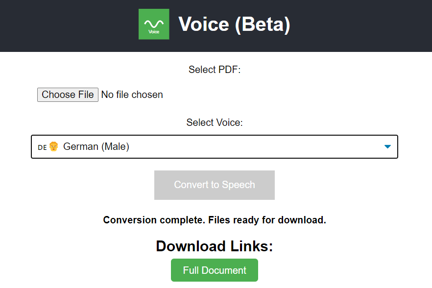

# Voice App

Voice is a web application that converts PDF documents to speech using AI-powered text-to-speech models. This README provides instructions on how to set up and run the Voice app locally or deploy it using Helm.

## Features

- Upload PDF files
- Convert PDF text to speech using various AI voice models
- Download the generated audio files

## AI Voice Models

## Voice Models

Voice uses the following AI voice models:

1. Morgan Freeman-like voice (en-US-GuyNeural)
2. David Attenborough-like voice (en-GB-RyanNeural)
3. Amitabh Bachchan-like voice (en-IN-PrabhatNeural)
4. British English Female (en-GB-SoniaNeural)
5. Hindi Female (hi-IN-SwaraNeural)
6. Hindi Male (hi-IN-MadhurNeural)
7. German Female (de-DE-KatjaNeural)
8. German Male (de-DE-ConradNeural)
9. US English Female (en-US-JennyNeural)
10. Indian English Female (en-IN-NeerjaNeural)

### Indian Celebrity-like Voices

11. Shah Rukh Khan-like voice (hi-IN-MadhurNeural)
12. Priyanka Chopra-like voice (hi-IN-SwaraNeural)
13. Amitabh Bachchan-like voice (en-IN-PrabhatNeural)
14. Deepika Padukone-like voice (en-IN-NeerjaNeural)
15. Aamir Khan-like voice (hi-IN-MadhurNeural)
16. Aishwarya Rai-like voice (hi-IN-SwaraNeural)

These models are provided by the Edge TTS (Text-to-Speech) service.

## Prerequisites

- Docker
- Docker Compose
- Helm (for Kubernetes deployment)

## Quick Start (Local Development)

1. Clone this repository:
   ```
   git clone https://github.com/yourusername/voice-app.git
   cd voice-app
   ```

2. Run the setup script:
   ```
   chmod +x run-voice-app.sh
   ./run-voice-app.sh
   ```

   This script will:
   - Check if Docker and Docker Compose are installed
   - Install Docker and Docker Compose if they're missing
   - Start the Voice app using Docker Compose

3. Access the Voice app at `http://localhost:5000`

## Manual Setup (Local Development)

If you prefer to set up the app manually or if the script doesn't work for your system, follow these steps:

1. Ensure Docker and Docker Compose are installed on your system.

2. Clone the repository and navigate to the project directory.

3. Run the following command to start the Voice app:
   ```
   docker-compose -f docker-compose.prod.yml up -d
   ```

4. Access the Voice app at `http://localhost:5000`

## Deployment with Helm

To deploy the Voice app using Helm, follow these steps:

1. Add the Helm repository and update:
   ```
   helm repo add stable https://charts.helm.sh/stable
   helm repo update
   ```

2. Update dependencies:
   ```
   helm dependency update ./voice-app
   ```

3. Install the Voice app:
   ```
   helm install voice-app ./voice-app
   ```

For more detailed information about the Helm chart, please refer to the [Helm Chart README](./voice/helm/README.md).

## Usage

1. Open the Voice app in your web browser.
2. Upload a PDF file using the file input field.
3. Select the desired AI voice model from the dropdown menu.
4. Click the "Convert to Speech" button.
5. Wait for the conversion process to complete.
6. Download the generated audio file(s) using the provided link(s).

## Troubleshooting

- If you encounter any issues with Docker installation or running the app, please refer to the official Docker documentation for your operating system.
- For app-specific issues, check the Docker logs using:
  ```
  docker-compose -f docker-compose.prod.yml logs
  ```
- For Helm deployment issues, check the Kubernetes pod logs and events.

## Support and Contributing

### Support the Project
If you find this project helpful, consider supporting its development:

[](https://paypal.me/abhikghosh87)

Every contribution helps maintain and improve the service! Your support enables:
- 🚀 Regular updates and improvements
- 📚 Better documentation
- 🛠️ New features development
- 🐛 Faster bug fixes
- 💬 Responsive support

### Connect & Contribute

- 🌟 Star this repository if you find it helpful
- 🔗 Follow on [LinkedIn](https://www.linkedin.com/in/abhik-ghosh-msc/) for updates
- 💬 Join our [My website](https://abhikghosh87.wixsite.com/website)
- 📝 Check out my [Blog Posts](https://medium.com/@abhikghosh_46536)

### Support the Project

If you find this project helpful, consider supporting its development:

- 💖 PayPal: [paypal.me/abhikghosh87](https://paypal.me/abhikghosh87)
- ⭐ Star this repository
- 📣 Share with others

### Technical Support
For technical questions and issues:
- Open an issue in the repository
- Contact the cloud infrastructure team

## License

MIT License - see the [LICENSE](LICENSE) file for details

---
Made with ❤️ by the community. Special thanks to all our supporters!
